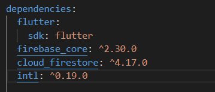
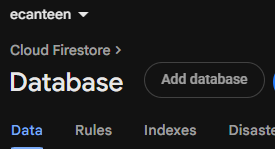
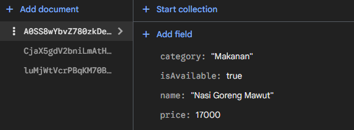
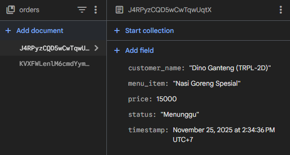
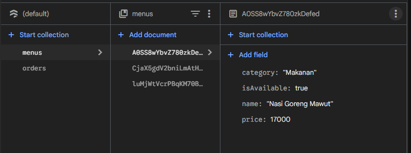
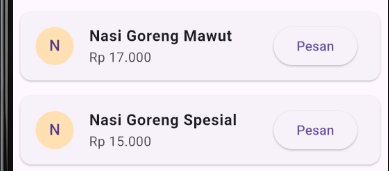
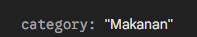
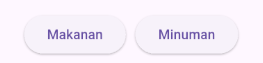

# Praktikum Mobile Programming – Integrasi Cloud Firestore (E-Canteen Poliwangi)

Disusun oleh:\
Dino Febiyan (362458302043)\
2D Teknologi Rekayasa Perangkat Lunak

---

## 1. Pendahuluan

Pada praktikum ini, saya akan mempelajari bagaimana cara mengintegrasikan aplikasi Flutter dengan **Cloud Firestore** sebagai backend NoSQL. Studi kasus yang saya gunakan adalah **E-Canteen Poliwangi**, yaitu aplikasi yang menampilkan daftar menu dan memungkinkan pengguna melakukan pemesanan. Praktikum ini saya harapkan akan dapat melatih saya unruk mengatur project Firebase, melakukan operasi Read (Stream) secara real-time, serta menulis data (Write) ke Firestore dari aplikasi mobile.

---

## 2. Tujuan Praktikum

Setelah menyelesaikan praktikum ini, saya berharap akan mampu:

* Memahami perbedaan dasar antara SQL dan NoSQL (Firestore).
* Menyiapkan dan mengonfigurasi project Firebase untuk aplikasi Flutter.
* Menghubungkan aplikasi Flutter ke Cloud Firestore (`firebase_core`, `cloud_firestore`).
* Menampilkan data secara real-time menggunakan `StreamBuilder`.
* Mengirim data pemesanan (create/write) ke koleksi `orders` di Firestore.
* Menangani kasus umum dan troubleshooting saat integrasi Firebase. 

---

## 3. Persiapan Environment & Pembuatan Project

### 3.1 Persiapan Environment

Sebelum memulai, saya memastikan environment berikut sudah terpasang:

* Flutter SDK (versi stabil)
* Node.js (untuk Firebase CLI)
* Firebase CLI: saya menginstal dengan perintah:

  ```
    npm install -g firebase-tools
  ```
* Saya melakukan login Firebase di terminal:

  ```
    firebase login
  ```

### 3.2 Membuat Project Flutter

Saya membuat project baru dengan perintah:

```
  flutter create e_canteen
  cd e_canteen
```

### 3.3 Menambahkan Package yang Diperlukan

Saya menambahkan package yang diperlukan untuk integrasi Firebase:

  

### 3.4 Mengonfigurasi Firebase ke Project Flutter

Saya menghubungkan project Flutter ke Firebase dengan tool `flutterfire`:

```
  flutterfire configure
```

Perintah ini membantu saya memilih project Firebase yang sudah saya buat di Firebase Console dan menghasilkan file `firebase_options.dart` berisi konfigurasi platform.

---

## 4. Setup Firebase Console (ringkasan)

Di Firebase Console saya melakukan langkah-langkah berikut:

1. Saya membuat project baru bernama `ecanteen`, dan menonaktifkan Google Analytics agar proses setup lebih cepat.


2. Saya membuka menu Build → Firestore Database → Create Database.

   * Location: saya memilih `asia-southeast2` (jakarta) agar latensinya rendah.
   * Security Rules: disini saya menggunakan **Test Mode** untuk praktikum.
3. Saya melakukan seeding data koleksi `menus` secara manual:

   * Collection ID: `menus`
   * Dokumen contoh:

     * `name`: `"Nasi Goreng Spesial"`
     * `price`: `15000`
     * `isAvailable`: `true`
   * selain itu saya juga menambahkan 3 dokumen menu berbeda agar UI punya data yang bermacam macam. 

---

## 5. Struktur Kode Utama & Potongan Kode Penting

Saya menempatkan logika utama di `lib/main.dart`. Struktur utama saya pecah menjadi:

* Bagian A: import dan `main()` (inisialisasi Firebase)
* Bagian B: state dan referensi koleksi (`menus`, `orders`)
* Bagian C: fungsi create (membuat pesanan ke Firestore)
* Bagian D: UI (menggunakan `StreamBuilder` untuk read real-time)

Berikut potongan penting dari `main.dart` yang saya gunakan.

### 5.1 Bagian A — Import & `main()`

```
  import 'package:flutter/material.dart';
  import 'package:firebase_core/firebase_core.dart';
  import 'package:cloud_firestore/cloud_firestore.dart';
  import 'package:intl/intl.dart';
  import 'firebase_options.dart';

  void main() async {
    WidgetsFlutterBinding.ensureInitialized();
    await Firebase.initializeApp(
      options: DefaultFirebaseOptions.currentPlatform,
    );
    runApp(const MyApp());
  }

  class MyApp extends StatelessWidget {
    const MyApp({ super.key });

    @override
    Widget build(BuildContext context) {
      return MaterialApp(
        debugShowCheckedModeBanner: false,
        title: 'Kantin Poliwangi',
        theme: ThemeData(primarySwatch: Colors.orange),
        home: const MenuPage(),
      );
    }
  }
```

### 5.2 Bagian B — State & Referensi Koleksi

```
  class MenuPage extends StatefulWidget {
    const MenuPage({ super.key });

    @override
    State<MenuPage> createState() => _MenuPageState();
  }

  class _MenuPageState extends State<MenuPage> {
    final CollectionReference _menuRef =
      FirebaseFirestore.instance.collection('menus');

    final CollectionReference _orderRef =
      FirebaseFirestore.instance.collection('orders');

    String formatRupiah(int price) {
      return NumberFormat.currency(locale: 'id_ID', symbol: 'Rp ', decimalDigits: 0)
        .format(price);
    }
```

### 5.3 Bagian C — Fungsi Create (Pemesanan)

```
  void _showOrderDialog(String menuName, int price) {
    final TextEditingController nameController = TextEditingController();

    showDialog(
      context: context,
      builder: (ctx) => AlertDialog(
        title: Text("Pesan $menuName"),
        content: TextField(
          controller: nameController,
          decoration: const InputDecoration(
            labelText: "Nama Pemesan",
            hintText: "Contoh: Budi (TI -2A)"
          ),
        ),
        actions: [
          TextButton(onPressed: () => Navigator.pop(ctx), child: const Text("Batal")),
          ElevatedButton(
            onPressed: () {
              if (nameController.text.isNotEmpty) {
                _orderRef.add({
                  'menu_item': menuName,
                  'price': price,
                  'customer_name': nameController.text,
                  'status': 'Menunggu',
                  'timestamp': FieldValue.serverTimestamp(),
                });
                Navigator.pop(ctx);
                ScaffoldMessenger.of(context)
                  .showSnackBar(const SnackBar(content: Text("Pesanan berhasil dikirim!")));
              }
            },
            child: const Text("Pesan Sekarang"),
          ),
        ],
      ),
    );
  }
```

### 5.4 Bagian D — UI & `StreamBuilder` (Read Real-Time)

```
  @override
  Widget build(BuildContext context) {
    return Scaffold(
      appBar: AppBar(title: const Text("E-Canteen Poliwangi")),
      body: StreamBuilder(
        stream: _menuRef.snapshots(),
        builder: (context, AsyncSnapshot<QuerySnapshot> snapshot) {
          if (snapshot.hasError) {
            return const Center(child: Text("Terjadi kesalahan koneksi."));
          }
          if (snapshot.connectionState == ConnectionState.waiting) {
            return const Center(child: CircularProgressIndicator());
          }
          if (snapshot.data!.docs.isEmpty) {
            return const Center(child: Text("Menu belum tersedia."));
          }
          return ListView.builder(
            itemCount: snapshot.data!.docs.length,
            itemBuilder: (context, index) {
              var doc = snapshot.data!.docs[index];
              Map<String, dynamic> data = doc.data() as Map<String, dynamic>;
              return Card(
                margin: const EdgeInsets.all(8),
                child: ListTile(
                  leading: CircleAvatar(
                    backgroundColor: Colors.orange.shade100,
                    child: Text(data['name'][0]),
                  ),
                  title: Text(data['name'], style: const TextStyle(fontWeight: FontWeight.bold)),
                  subtitle: Text(formatRupiah(data['price'] ?? 0)),
                  trailing: ElevatedButton(
                    onPressed: data['isAvailable'] == true
                      ? () => _showOrderDialog(data['name'], data['price'])
                      : null,
                    child: Text(data['isAvailable'] ? "Pesan" : "Habis"),
                  ),
                ),
              );
            },
          );
        },
      ),
    );
  }
```

Potongan kode di atas menunjukkan alur utama program yaitu membaca koleksi `menus` secara realtime, menampilkan daftar menu, dan mengirim pesanan ke koleksi `orders`. 

---

## 6. Langkah Pengujian & Hasil

### 6.1 Pengujian Fungsi Baca (Read)

* Saya menambahkan data `menus` di Firestore Console (seeding) seperti instruksi.\


* Saat menjalankan aplikasi, `StreamBuilder` yang akan menampilkan daftar menu secara otomatis.

* Ketika saya mengubah data `menus` di Console (mis. ubah `isAvailable`), maka UI aplikasi akan langsung terupdate tanpa kita perlu reload manual.

### 6.2 Pengujian Fungsi Tulis (Write)

* Saya melakukan pemesanan melalui tombol `Pesan`.

* Setelah mengisi nama pemesan dan menekan `Pesan Sekarang`, saya memeriksa Firestore Console dan menemukan dokumen baru di koleksi `orders` dengan field `menu_item`, `price`, `customer_name`, `status`, dan `timestamp`.


* Hal ini membuktikan bahwa operasi write sudah berhasil.

---

## 7. Tugas Praktikum (Lab & Tantangan)

### 7.1 Tugas Wajib

1. Menjalankan aplikasi dan membuktikan bahwa data yang muncul sesuai dengan yang ada di Firebase Console (`menus`).



2. Melakukan pemesanan, lalu menunjukkan bahwa dokumen pesanan masuk ke koleksi `orders`.

### 7.2 Tantangan (Nilai Plus)

* Menambahkan field `category` pada dokumen `menus` (mis. `Makanan`, `Minuman`).\
\
* Menambahkan tombol filter pada UI aplikasi (mis. tombol `Makanan` dan `Minuman`).\

* Mengaplikasikan query `.where('category', isEqualTo: ...)` pada `StreamBuilder` sehingga daftar menu dapat difilter berdasarkan kategori.
```
 stream: _menuRef.where('category', isEqualTo: selectedCategory).snapshots(),
```
* Hasil

---

## 8. Kesimpulam

Melalui praktikum Integrasi Cloud Firestore pada aplikasi E-Canteen Poliwangi ini, saya berhasil menyiapkan project Flutter dan menghubungkannya dengan Firebase, menampilkan data `menus` secara real-time menggunakan `StreamBuilder`, serta menyediakan antarmuka pemesanan yang langsung menulis ke koleksi `orders`. Selain itu, saya juga mampu mengatasi berbagai kendala umum dalam proses integrasi Firebase dengan menerapkan solusi praktis yang relevan. Praktikum ini menunjukkan bahwa penggunaan Cloud Firestore memberikan keunggulan dalam pengembangan aplikasi yang cepat dan responsif berkat dukungan pembaruan data secara real-time serta fleksibilitas model NoSQL. Praktikum ini sekaligus memperkuat pemahaman saya mengenai arsitektur client-server modern pada aplikasi mobile, sehingga menambah wawasan dan keterampilan dalam membangun sistem yang efisien dan adaptif.